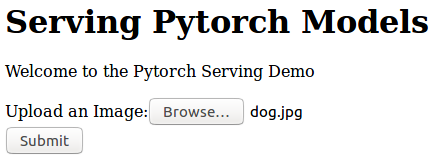
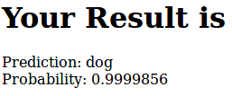
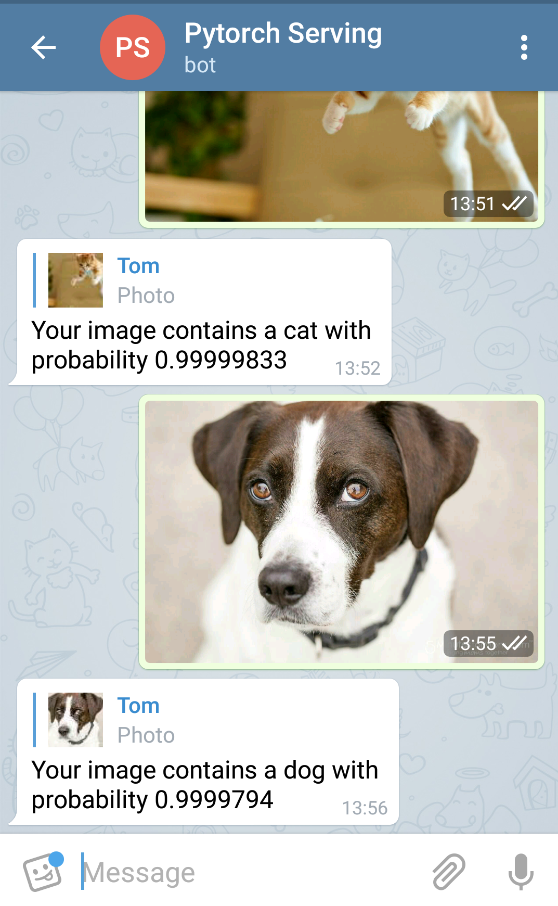

# Serving Fastai Models

The aim of this project was to develop a minimal Django webapp that will allow you to serve a fastai model. There are currently three ways to submit an image:

- From the "webapp"
- Via an API request
- Through a telegram chatbot

## Get started

Install dependencies using conda environment:

```sh
conda create --name "myEnv" python=3.6 --file package-list.txt
conda activate myEnv
```

Then run the webapp:

```sh
python manage.py runserver
```

## Set Up the Telegram Bot

To set up a telegram bot, you must register a new bot via telegram. Add the `BotFather` account and after `/start` type `/newbot`. Then follow the prompts until your bot is registered. You are presented with a bot token which you should save and place into the `webhook/config.py` file as the `TG_TOKEN` variable so the the app can access your bot's API.

## For Local Testing

The webapp works locally and can be interacted with and uploaded to without hassle.

The Telegram bot requires more infrastructure to receive messages (Public IP address and SSL certificate) via webhook. Thus for the purposes of testing, you can simulate the post requests to and from the Telegram API. By running the `message_collector.py` script, you can see the structure of the requests which you can then post to your Django app using something like [Postman](https://www.getpostman.com/) or `curl`.

You can copy the message content from the bot and paste it into Postman as a raw body of type JSON. Then this post acts as the webhook which will be directly received from Telegram in production.

The structure of the message will look something like:

```json
{
    "message": {
        "message_id": 1,
        "date": 111111,
        "chat": {
            "id": 111111,
            "type": "private",
            "first_name": "Tom"
        },
        "text": "/help",
        "message": "/help",
        "entities": [
            {
            "type": "bot_command",
            "offset": 0,
            "length": 5
            }
        ],
        "caption_entities": [],
        "photo": [],
        "new_chat_members": [],
        "new_chat_photo": [],
        "delete_chat_photo": "False",
        "group_chat_created": "False",
        "supergroup_chat_created": "False",
        "channel_chat_created": "False",
        "from": {
            "id": 11111,
            "first_name": "Tom",
            "is_bot": "False",
            "language_code": "en-gb"
        }
    },
    "update_id": 111111
}
```

## Structure

Put trained Pytorch `.pth` models in `datamodels/models`

Put dummy categories into `datamodels/train` and `datamodels/valid`. Test directory is not required.

Create `tmp` directory to store uploaded photos.

In the `webhook` directory, add your telegram chatbot's token to the `config.py` file.

## Querying the Chatbot

Sending an image to the chatbot will automatically add the image to a queue to be classified.

## Machine Learning Models

This project uses Pytorch v1 and thus only accommodates these models, and any sub-classes.

Your model should be saved for whatever architecture you intend to do inference on: CPU or GPU.

## Read More

For more about the Telegram bot see:

- [Deployment](https://github.com/python-telegram-bot/python-telegram-bot/wiki/Where-to-host-Telegram-Bots)
- [Webhooks](https://github.com/python-telegram-bot/python-telegram-bot/wiki/Webhooks)
- [Python Telegram Bot Docs](https://python-telegram-bot.readthedocs.io/en/stable/)

For more about the Django app see:

- [Django Docs](https://docs.djangoproject.com/en/2.1/)
- [Saving images](https://docs.djangoproject.com/en/2.1/topics/http/file-uploads/)

For more about Pytorch models see:

- [Saving models](https://pytorch.org/tutorials/beginner/saving_loading_models.html)
- [Saving and loading Fastai Models](https://docs.fast.ai/basic_train.html#Saving-and-loading-models) - The Fastai library wraps Pytorch and thus any models trained with it can be used there. In fact, the demo [cats vs dogs model](https://github.com/fastai/fastai/blob/master/courses/dl1/lesson1.ipynb) was trained with Fastai.
- [Pytorch v1 Docs](https://pytorch.org/docs/master/)
- [Fastai v1 Docs](https://docs.fast.ai)

## Demo

### The barebones webapp interface:


### Classification response:


### Telegram Bot:


## License

This project is licensed under the MIT license. Please see the full license in the `LICENSE` file.
